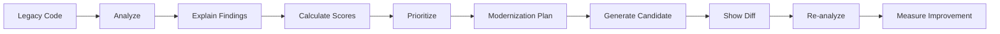

<div align="center">

# ⚡ RecodeAI

### Understand Legacy. Modernize with Confidence.

**An explainable legacy-code modernization engine that helps developers analyze technical debt, understand risk, prioritize improvements, generate conservative modernization candidates, and measure the result.**

<br>

`ANALYZE` → `EXPLAIN` → `PRIORITIZE` → `MODERNIZE` → `MEASURE`

<br>


**Python · JavaScript · Java**

</div>

---

## 🚀 What is RecodeAI?

Legacy applications often continue to perform critical work long after the technologies and practices used to build them have become outdated.

Modernizing those systems is difficult because developers first need to answer several questions:

- What is actually wrong with this code?
- Which issues matter most?
- Are there security concerns?
- Which patterns are outdated?
- What should be modernized first?
- Could an automated rewrite change program behavior?
- Did the modernization actually improve anything?

**RecodeAI turns those questions into an explainable engineering workflow.**

Instead of treating modernization as a black-box **"rewrite my code"** operation, RecodeAI separates the process into five stages:

```text
Legacy Source Code
       │
       ▼
   🔍 ANALYZE
       │
       ▼
   💡 EXPLAIN
       │
       ▼
   🎯 PRIORITIZE
       │
       ▼
   🔧 MODERNIZE
       │
       ▼
   📊 MEASURE
```

The developer remains in control throughout the process.

---

# 💡 The Problem

Modernizing legacy software is expensive and risky.

Developers may need to manually inspect thousands of lines of source code to discover:

- insecure programming practices,
- deprecated or legacy constructs,
- maintainability problems,
- weak observability,
- technical debt,
- hard-coded secrets,
- unsafe operations,
- outdated APIs,
- and potentially dangerous modernization opportunities.

Blindly generating replacement code introduces another problem:

> **How does the developer know why something changed or whether the change preserved the original behavior?**

RecodeAI addresses this by making modernization **explainable, prioritized, reviewable, and measurable**.

---

# ✨ Core Features

## 🔍 Explainable Static Analysis

RecodeAI analyzes source code using deterministic rules and identifies modernization concerns across several categories.

Each finding can include:

- category,
- severity,
- title,
- explanation,
- source location,
- and recommended remediation.

Severity levels:

```text
🔴 CRITICAL
🟠 HIGH
🟡 MEDIUM
🟢 LOW
```

---

## 🛡️ Security Analysis

RecodeAI can detect patterns associated with issues such as:

- `eval()` usage,
- `exec()` usage,
- dangerous shell execution,
- insecure hashing algorithms,
- unsafe deserialization,
- potential hard-coded secrets,
- insecure HTTP endpoints,
- and dynamic SQL construction.

---

## 🧹 Maintainability Analysis

The engine also detects patterns that make legacy systems harder to maintain, including:

- bare exception handlers,
- TODO / FIXME / HACK markers,
- long source lines,
- oversized source files,
- outdated language constructs,
- and weak observability patterns.

---

# 📊 Explainable Health Scores

RecodeAI doesn't stop at listing warnings.

It converts its findings into four understandable software-health indicators:

| Score | Purpose |
|---|---|
| 🛡️ **Security** | Indicates security-related modernization concerns |
| 🧹 **Maintainability** | Reflects maintainability and code-quality issues |
| ⚡ **Modernization** | Reflects legacy constructs and modernization opportunities |
| 🎯 **Overall** | Combined view of the analyzed source |

The goal is not to replace engineering judgment.

The scores provide developers with a **consistent way to understand and compare analysis results**.

---

# 🎯 Prioritized Modernization Plan

Finding problems is only the beginning.

RecodeAI converts analysis results into an actionable modernization plan.

```text
Detected Findings
       │
       ▼
Severity Assessment
       │
       ▼
Category Analysis
       │
       ▼
Prioritized Plan
       │
       ▼
Developer Review
```

This helps answer:

> **What should I work on first?**

---

# 🔧 Conservative Modernization

RecodeAI intentionally avoids treating every detected problem as automatically fixable.

For supported deterministic transformations, the platform can generate a modernization candidate.

Potentially behavior-changing issues remain visible for developer review.

This creates an important distinction:

```text
Detection ≠ Automatic Rewrite
```

RecodeAI is designed to help developers **understand changes before accepting them**.

---

# 🔀 Before / After Comparison

When a modernization candidate is generated, RecodeAI exposes both versions:

```text
┌───────────────────────┐    ┌────────────────────────┐
│      LEGACY CODE      │    │    MODERNIZED CODE     │
│                       │ →  │                        │
│ Original implementation│   │ Proposed candidate     │
└───────────────────────┘    └────────────────────────┘
```

A unified diff makes the transformation inspectable.

Developers can see:

- what was removed,
- what was added,
- what was changed,
- and what remained untouched.

---

# 📈 Measure the Result

After modernization, RecodeAI analyzes the resulting code again.

```text
BEFORE                       AFTER

Security      ───────▶       Security
Maintainability ─────▶       Maintainability
Modernization ───────▶       Modernization
Overall       ───────▶       Overall
```

The API can report:

- before scores,
- after scores,
- number of findings before,
- number of findings after,
- findings resolved,
- and overall score improvement.

This completes the loop:

> **Analyze → Modernize → Re-analyze → Compare**

---

# 🧠 Supported Languages

The current MVP supports:

| Language | Analysis | Modernization Workflow |
|---|:---:|:---:|
| 🐍 Python | ✅ | ✅ |
| 🟨 JavaScript | ✅ | ✅ |
| ☕ Java | ✅ | ✅ |

The architecture is designed so additional language rules can be introduced as the project evolves.

---

# 🏗️ Architecture

```text
                         ┌──────────────────────┐
                         │      Developer       │
                         └──────────┬───────────┘
                                    │
                                    ▼
                    ┌──────────────────────────────┐
                    │       React + TypeScript     │
                    │          Frontend            │
                    └──────────────┬───────────────┘
                                   │
                              REST API
                                   │
                                   ▼
                    ┌──────────────────────────────┐
                    │           FastAPI            │
                    │           Backend            │
                    └──────────────┬───────────────┘
                                   │
                  ┌────────────────┴────────────────┐
                  │                                 │
                  ▼                                 ▼
        ┌──────────────────┐              ┌──────────────────┐
        │ Analysis Engine  │              │ Modernizer       │
        │                  │              │                  │
        │ Security         │              │ Candidate        │
        │ Maintainability  │              │ Transformations  │
        │ Legacy Patterns  │              │ Diff Generation  │
        │ Quality          │              │                  │
        │ Observability    │              │                  │
        └────────┬─────────┘              └────────┬─────────┘
                 │                                 │
                 └────────────────┬────────────────┘
                                  ▼
                      ┌────────────────────────┐
                      │   Scoring + Planning   │
                      │                        │
                      │ Security Score         │
                      │ Maintainability Score  │
                      │ Modernization Score    │
                      │ Overall Score          │
                      └────────────────────────┘
```

---

# 🔄 RecodeAI Workflow



---

# 🤖 IBM Bob Engineering Review

RecodeAI was not only built as a prototype — its engineering approach was also reviewed using **IBM Bob**.

IBM Bob was used as an engineering review layer focusing on:

- backend architecture,
- separation of concerns,
- static-analysis quality,
- false-positive risks,
- transformation safety,
- API validation,
- error handling,
- maintainability,
- and test coverage.

The workflow was:

```text
                RecodeAI MVP
                     │
                     ▼
              IBM Bob Review
                     │
                     ▼
          Engineering Findings
                     │
                     ▼
           Prioritize Risks
                     │
                     ▼
          Implement Improvements
                     │
                     ▼
           Regression Testing
                     │
                     ▼
             Improved RecodeAI
```

One important review area was **transformation safety**.

The review identified cases where apparently simple modernization transformations could affect program behavior or produce inconsistent output.

For example, Java modernization involving:

```java
Vector<String> items = new Vector<>();
```

must consider both the declared type **and** the instantiation rather than modifying only one side.

Similarly, replacing JavaScript:

```javascript
var value = ...
```

with:

```javascript
let value = ...
```

cannot universally be considered behavior-preserving because JavaScript scoping and hoisting semantics differ.

This reinforced one of RecodeAI's central design principles:

> **Modernization should be explainable and reviewable — not blindly automated.**

---

# 🧪 API

## Health

```http
GET /api/health
```

Example response:

```json
{
  "status": "healthy",
  "service": "RecodeAI API",
  "version": "0.2.0"
}
```

---

## Supported Languages

```http
GET /api/languages
```

---

## Analyze Code

```http
POST /api/analyze
```

Example request:

```json
{
  "language": "python",
  "code": "result = eval(user_input)"
}
```

The response includes:

```text
language
lines_of_code
findings
scores
modernization_plan
summary
```

---

## Modernize Code

```http
POST /api/modernize
```

Example request:

```json
{
  "language": "javascript",
  "code": "var message = 'hello';",
  "apply_safe_fixes": true
}
```

The response can include:

```text
original_code
modernized_code
changes
unified_diff
before_scores
after_scores
before_findings
after_findings
score_improvement
findings_resolved
```

---

# 🗂️ Project Structure

```text
RecodeAI/
│
├── backend/
│   ├── app/
│   │   ├── __init__.py
│   │   ├── main.py
│   │   ├── models.py
│   │   ├── analyzer.py
│   │   └── modernizer.py
│   │
│   ├── tests/
│   │   └── test_api.py
│   │
│   └── requirements.txt
│
├── frontend/
│   ├── src/
│   │   ├── App.tsx
│   │   ├── App.css
│   │   └── main.tsx
│   │
│   └── package.json
│
├── docs/
│   ├── architecture.md
│   ├── demo-guide.md
│   └── BOB_USAGE.md
│
├── .gitignore
└── README.md
```

---

# ⚙️ Run Locally

## 1. Clone

```bash
git clone <YOUR_REPOSITORY_URL>
cd RecodeAI
```

---

## 2. Start the Backend

### Windows PowerShell

```powershell
cd backend

python -m venv .venv

.\.venv\Scripts\Activate.ps1

pip install -r requirements.txt

uvicorn app.main:app --reload
```

Backend:

```text
http://127.0.0.1:8000
```

Interactive API documentation:

```text
http://127.0.0.1:8000/docs
```

---

## 3. Start the Frontend

Open another terminal:

```powershell
cd frontend

npm install

npm run dev
```

Then open the local URL shown by Vite.

Typically:

```text
http://localhost:5173
```

---

# 🧪 Run Tests

From the backend directory:

```powershell
.\.venv\Scripts\Activate.ps1
pytest -v
```

Frontend production build:

```powershell
cd frontend
npm run build
```

---

# 🎬 Demo Scenario

Try analyzing:

```python
import os
import hashlib
import pickle

password = "admin123"

def process(data):
    print("Processing user data")
    result = eval(data)
    os.system("echo processing")
    token = hashlib.md5(data.encode()).hexdigest()
    return pickle.loads(result)
```

This deliberately problematic example allows the demo to showcase several analysis categories and severity levels.

The demo flow is:

```text
Paste Legacy Code
       ↓
Select Language
       ↓
Analyze
       ↓
Review Findings
       ↓
Inspect Health Scores
       ↓
Review Modernization Plan
       ↓
Generate Candidate
       ↓
Inspect Before / After
       ↓
Review Unified Diff
       ↓
Measure Result
```

---

# 🎨 Product Philosophy

RecodeAI follows four principles.

### 01 — Explain before changing

Developers should understand why something has been identified before considering a modification.

### 02 — Prioritize instead of overwhelm

A long list of warnings is less useful than a structured modernization plan.

### 03 — Don't pretend every fix is safe

Some transformations can change behavior.

Those decisions belong to the developer.

### 04 — Measure what changed

Modernization should produce inspectable results rather than an unexplained replacement file.

---

# ⚠️ Current MVP Limitations

RecodeAI is a hackathon MVP and intentionally has a focused scope.

The current analyzer is primarily deterministic and rule-based rather than a complete compiler-level static-analysis system.

Therefore:

- findings may contain false positives,
- analysis does not provide full semantic understanding,
- transformation coverage is intentionally limited,
- not every recommendation is automatically applied,
- generated modernization candidates should be reviewed,
- and the current scoring model is a prioritization aid rather than a formal security certification.

These limitations are intentional.

**RecodeAI prefers transparent uncertainty over pretending an unsafe transformation is guaranteed to be correct.**

---

# 🛣️ Roadmap

```text
RecodeAI
│
├── ✓ Explainable static analysis
├── ✓ Severity classification
├── ✓ Health scoring
├── ✓ Modernization planning
├── ✓ Before / after comparison
├── ✓ Unified diff
├── ✓ Python support
├── ✓ JavaScript support
├── ✓ Java support
│
├── ◇ AST-based analysis
├── ◇ Repository-level analysis
├── ◇ Dependency modernization
├── ◇ Framework migration assistance
├── ◇ Deeper data-flow analysis
├── ◇ Automated regression validation
├── ◇ Pull-request integration
├── ◇ CI/CD modernization gates
└── ◇ Additional languages
```

---

# 🏆 IBM Bob 2 Hackathon

RecodeAI was developed for the **IBM Bob 2 Hackathon**.

The project explores how explainable developer tooling can make software modernization more structured and reviewable.

IBM Bob was incorporated into the engineering-review workflow to examine the prototype and surface implementation risks and test gaps.

---

# 🌟 Why RecodeAI?

Traditional approach:

```text
Legacy Code
     ↓
"Rewrite this"
     ↓
Large Generated Change
     ↓
Hope Nothing Broke
```

RecodeAI:

```text
Legacy Code
     ↓
Analyze
     ↓
Explain
     ↓
Prioritize
     ↓
Modernize
     ↓
Inspect Diff
     ↓
Re-analyze
     ↓
Measure
     ↓
Developer Decision
```

### Modernization shouldn't be a leap of faith.

## It should be an explainable engineering process.

---

<div align="center">

# ⚡ RecodeAI

### Understand the past. Modernize the future.

**Analyze · Explain · Prioritize · Modernize · Measure**

<br>

Built for the **IBM Bob 2 Hackathon**

</div>